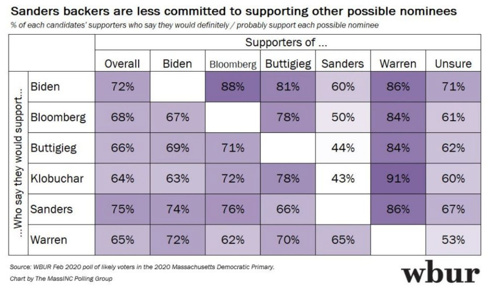

Analyzing 2/28/2020 WBUR Mass poll results
================
Gavin Fay
2/28/2020

### Overall scores for candidates from this graphic are calculated based on averages, which assumes each candidate has the same number of supporters. I decided to recalculate these values based on the reported percentage of supporters in the article.



### enter data from WBUR graphic

Data taken from
<https://www.wbur.org/news/2020/02/28/wbur-poll-sanders-opens-substantial-lead-in-massachusetts-challenging-warren-on-her-home-turf>

``` r
wbur <- tibble(would_support = c("Biden",
                         "Bloomberg",
                         "Buttigieg",
                         "Klobuchar",
                         "Sanders",
                         "Warren"),
               Biden = c(1, 0.67, 0.69, 0.63, 0.74, 0.72),
               Bloomberg = c(0.88, 1, 0.71, 0.72, 0.76, 0.62),
               Buttigieg = c(0.81, 0.78, 1, 0.78, 0.66, 0.7),
               Sanders = c(0.6, 0.5, 0.44, 0.43, 1, 0.65),
               Warren = c(0.86, 0.84, 0.84, 0.91, 0.86, 1),
               Unsure = c(0.71, 0.61, 0.62, 0.6, 0.67, 0.53))
wbur <- wbur %>% 
  pivot_longer(cols = -1,
               names_to = "preferred",
               values_to = "value")

wbur
```

    ## # A tibble: 36 x 3
    ##    would_support preferred value
    ##    <chr>         <chr>     <dbl>
    ##  1 Biden         Biden      1   
    ##  2 Biden         Bloomberg  0.88
    ##  3 Biden         Buttigieg  0.81
    ##  4 Biden         Sanders    0.6 
    ##  5 Biden         Warren     0.86
    ##  6 Biden         Unsure     0.71
    ##  7 Bloomberg     Biden      0.67
    ##  8 Bloomberg     Bloomberg  1   
    ##  9 Bloomberg     Buttigieg  0.78
    ## 10 Bloomberg     Sanders    0.5 
    ## # … with 26 more rows

## current proportion of supporters

I assumed that ‘unsure’ included supporters of other democratic
candidates as who they would likely support was not reported in the
graphic.

``` r
supporters <- tibble(
  candidates = c("Biden",
                         "Bloomberg",
                         "Buttigieg",
                         #"Klobuchar",
                         "Sanders",
                         "Warren",
                   "Unsure"),
  prop = c(0.09, 0.13, 0.14, 0.25, 0.17, 0.02 + 0.01 + 0.04 + 0.08 + 0.06)
) %>% 
  mutate(prop = prop/sum(prop))
supporters
```

    ## # A tibble: 6 x 2
    ##   candidates   prop
    ##   <chr>       <dbl>
    ## 1 Biden      0.0909
    ## 2 Bloomberg  0.131 
    ## 3 Buttigieg  0.141 
    ## 4 Sanders    0.253 
    ## 5 Warren     0.172 
    ## 6 Unsure     0.212

## calculate overall score

``` r
wbur_summary <- wbur %>% left_join(supporters, 
                           by = c("preferred" = "candidates")) %>% 
  group_by(would_support) %>% 
  mutate(overall = prop*value) %>% 
  summarize(overall = round(sum(overall),digits=2))
wbur_summary
```

    ## # A tibble: 6 x 2
    ##   would_support overall
    ##   <chr>           <dbl>
    ## 1 Biden            0.77
    ## 2 Bloomberg        0.7 
    ## 3 Buttigieg        0.68
    ## 4 Klobuchar        0.65
    ## 5 Sanders          0.8 
    ## 6 Warren           0.69

Expected overall score for Biden, Sanders & Warren increases when the
varying number of supporters for each candidate is accounted for.

## Typo in graphic

Given the overall scores in the WBUR graphic are averages of the other
columns, there is an error for Biden. According to this approach, the
overall score should be `(88+81+60+86+71)/5 = 77%` rather than `72%`.
